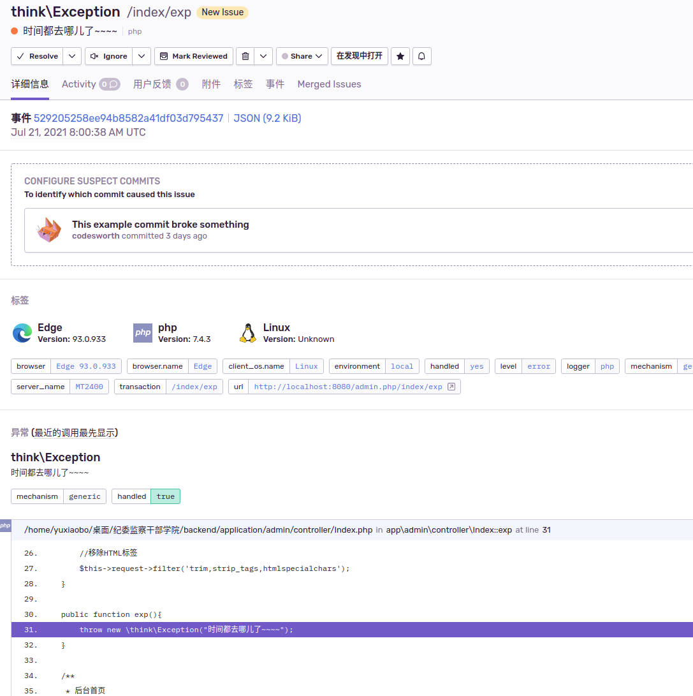
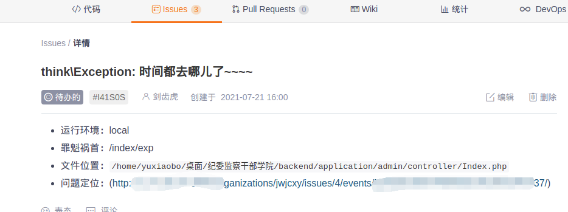

# sentry网络钩子 创建gitee issue

项目中使用了sentry，可以配合这个项目给gitee仓库创建issue。可以把问题和解决关联起来

*commit时加入`CLOSE #ISSUEID`可关闭issue并关联起来*


## 截图

sentry


gitee



## 安装使用

#### 1.克隆仓库并部署（后台部署可以使用`pm2`）
```
git clone https://github.com/edk24/sentry_webhook_wxpusher.git
```

#### 2.配置

```
cp config.json.example config.json 

按照要求配置文件
```

#### 3.运行

```
npm install
npm start
```

访问地址 http://xxx.xxx.xxx.xxx:8081 出现`hello`表示部署成功

#### 4.配置sentry webhook 

打开`sentry`后台，找到`Setting -> Developer settings -> INTERNAL INTEGRATIONS` 创建

`Alert Rule Action`启用，

`Webhook URL`填入‘http://你的地址/sentry’

`issue`和`error`选中，最后保存触发一个错误试试吧